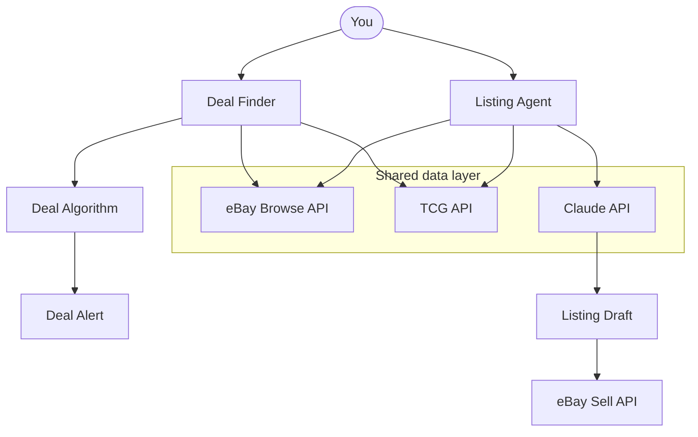
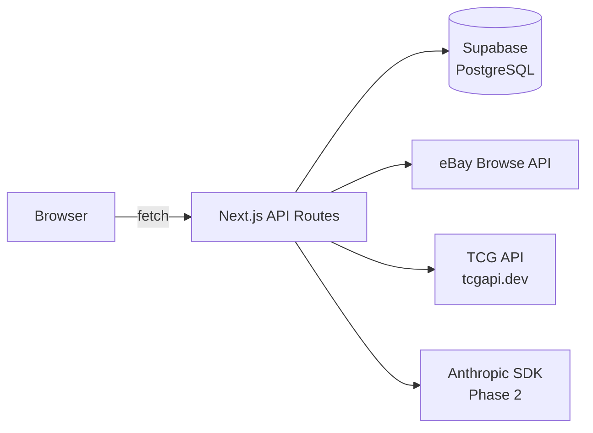
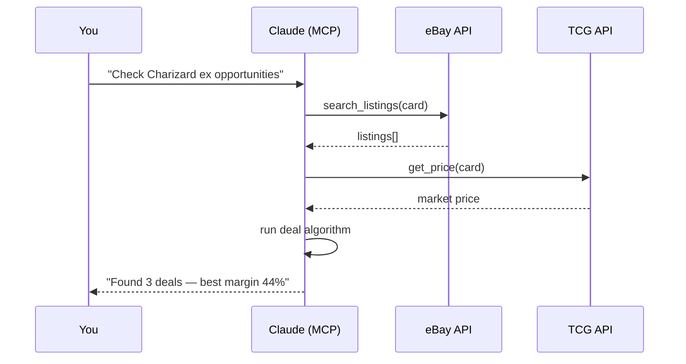

# Architecture

## System overview



## Data flow



The browser never calls external APIs or the database directly. Everything goes through Next.js API routes.

---

## Deal algorithm

Implemented as pure functions in `lib/deal-algorithm.ts`.

```
sellAt   = TCG market price × 0.85     (conservative resale target)
ebayFee  = sellAt × 13.25%
payFee   = sellAt × 3.00%
shipping = $3 | $5.50 | $8             (tiered by listing price)
profit   = sellAt − ebayFee − payFee − shipping − listingPrice
margin   = profit / sellAt × 100

isDeal   = margin ≥ minMargin           (user-configurable, default 30%)
```

Fee constants and the 85% sell target are not user-configurable. The only user control is the minimum margin threshold (10–60%, step 5%).

---

## Database schema

```
wishlists
  id, name, created_at

wishlist_cards
  id, wishlist_id → wishlists,
  tcg_card_id, game, set, card_number, card_name, rarity,
  condition, tcg_market, tcg_low, art, image_url, created_at

scan_results
  id, card_id → wishlist_cards,
  listing_id, title, price, condition, listing_type,
  sold_30 (column kept, never written — Browse v1 doesn't provide this),
  net_profit, margin, is_deal, ebay_url, scanned_at

price_snapshots
  id, card_id → wishlist_cards,
  tcg_market, avg_ebay_listing, deal_count, taken_at
```

`wishlists` / `wishlist_cards` is the DB naming; the application layer uses `watchlist` everywhere (routes, UI, TypeScript identifiers). Do not rename the DB tables/columns — that requires a migration. `price_snapshots` is written daily per card and powers the trend chart and momentum signals on the dashboard.

---

## API integrations

### eBay Browse API
- **Auth**: OAuth 2.0 client credentials (app token — no user login needed). Token cached in `globalThis.__ebayToken`; survives serverless warm restarts.
- **Endpoint**: `GET /buy/browse/v1/item_summary/search`
- **Query construction**: 3-tier waterfall in `lib/query-builder.ts` — Tier 1 (name + number, tight), Tier 2 (name + set + game keyword, medium), Tier 3 (name + game + tcg, broad). Falls to next tier when a tier returns < 3 results. Tier 3 results flagged `isLowConfidence: true`. Card numbers are unquoted so eBay handles slash variants (`199/165`). Price ceiling `price:[0..tcgMarket×1.1]` on all tiers.
- **Game-specific logic**: Pokémon uses number as unique key; One Piece appends rarity abbreviation (SEC/SR/Leader at all tiers, R at Tier 1 only, UC/C omitted) and excludes `-Japanese -JP`.
- **Mapped fields**: `isGraded` (title regex post-fetch), `listingImageUrl`, `endsAt`, `bidCount`, `currentBidPrice`, `sellerFeedback`. `sold30` is not available in Browse v1.
- **Tier 3 / isLowConfidence**: results are shown in the UI but never flagged `isDeal` — too broad to trust for deal scoring. See `docs/ebay-scan.md` for full detail.
- **Rate limit**: 5,000 calls/day — 5 concurrent queries keeps well under the cap
- **Env vars**: `EBAY_CLIENT_ID`, `EBAY_CLIENT_SECRET`, `EBAY_MARKETPLACE_ID`

### TCG API (tcgapi.dev)
- **Purpose**: card catalog (sets + cards per set), market and low prices
- **Rate limit**: 100 calls/day on free tier — all responses cached 24h in-memory
- **Env var**: `TCG_API_KEY`

### Anthropic SDK (Phase 2)
- **Purpose**: generate eBay listing titles, descriptions, pricing, item specifics
- **Prompt pattern**: system prompt (listing skill) + card data + sold comps as few-shot examples → JSON `{ title, price, description, item_specifics }`
- **Model routing**: `claude-haiku-4-5` for <$5 · `claude-sonnet-4-6` for $5–$100 · `claude-opus-4-7` for $100+
- **Env var**: `ANTHROPIC_API_KEY`

---

## Pages

| Route | Component | Purpose |
|-------|-----------|---------|
| `/` | `app/page.tsx` | Dashboard — stats, top movers, recent scans |
| `/deal-finder` | `app/deal-finder/page.tsx` | Standalone card lookup (no watchlist context) |
| `/watchlist` | `app/watchlist/page.tsx` | Build and manage named watchlists, browse cards |
| `/scan` | `app/scan/page.tsx` | Run eBay scan against a selected watchlist |

## API routes

| Route | Method | Purpose |
|-------|--------|---------|
| `/api/sets` | GET | List sets for a game |
| `/api/cards` | GET | Paginated card catalog, optional name search |
| `/api/watchlists` | GET, POST | List / create watchlists |
| `/api/watchlists/[id]/cards` | GET, POST | List / add cards to a watchlist |
| `/api/watchlists/[id]/cards/[cardId]` | DELETE | Remove a card from a watchlist |
| `/api/scan` | POST | Run eBay deal scan for a watchlist |
| `/api/top-movers` | GET | Cards with biggest price delta for dashboard |

---

## Key design decisions

- **No open-ended card search** — game → set → card number/name only. Every listing maps to a known card with a TCG price. Open-ended search would break the deal algorithm.
- **Server-side only** — browser never calls eBay, TCG API, or Supabase directly. Keeps API keys off the client and enforces rate-limit control.
- **Fixed fee constants** — eBay 13.25%, payment 3.00%, shipping $3/$5.50/$8. Not user-configurable; these are platform realities.
- **Sell at 85% of TCG market** — conservative resale target that accounts for market variance and time-to-sell.
- **24h TCG API cache** — free tier is 100 calls/day; cache survives the server process lifetime.
- **5 concurrent eBay queries** — stays well within the 5,000 calls/day rate limit.
- **No auth in Phase 1** — single-user local tool. Clerk added when opening to the public.
- **Vercel → Railway migration at Phase 3** — node-cron requires a persistent process; Vercel serverless functions can't hold one.

---

## Phase 2 — Listing Agent

Uses the same card lookup + eBay sold comps as few-shot examples for Claude:

```
System: You are an expert eBay trading card seller...
User:   card: 2003 Pokemon EX Dragon Flygon #94 Holo Rare
        condition: Near Mint
        tcg_market_price: $47.00
        sold_comps: [{ title: "...", sold_price: "$52", description: "..." }]

Claude: { title, price, description, item_specifics }
```

Flow: card selection → fetch sold comps → call Claude → review UI → approve → publish via eBay Sell API (requires OAuth user token, separate from the Browse API app token).

---

## Phase 3 — MCP Automation

Exposes eBay, TCG API, and Claude as MCP tools. Claude orchestrates the full scan and listing flow autonomously; the user only reviews output.



Requires Railway hosting (persistent Node.js server for node-cron scheduled scans).
