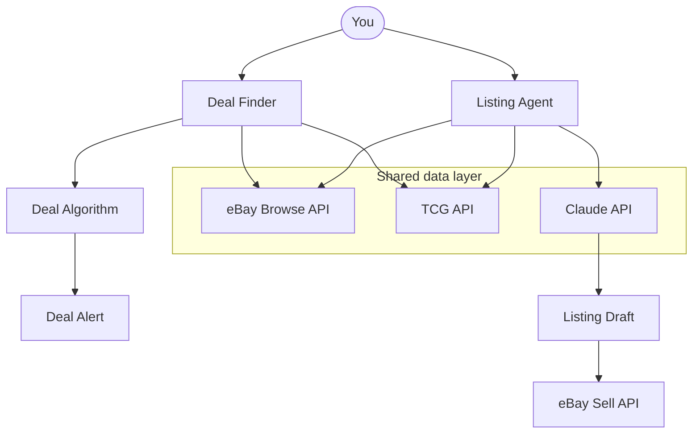
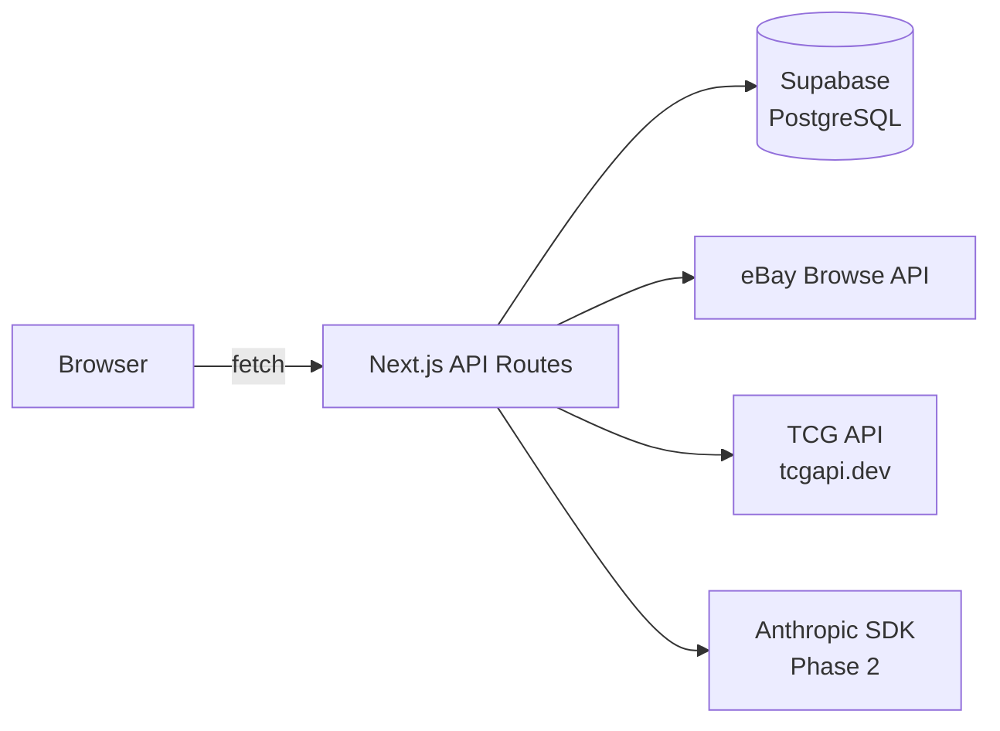
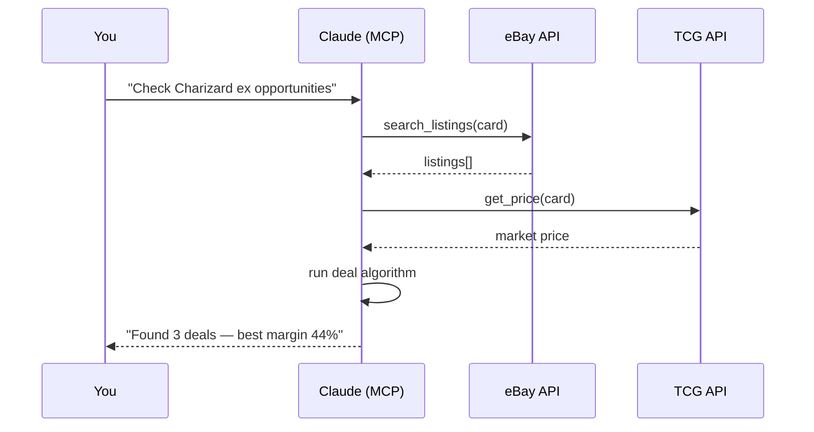

# Card Trading Engine

A two-sided platform for discovering underpriced trading cards on eBay and generating optimised eBay listings — powered by real market data and AI-assisted content generation.

---

## Phases

| Phase | Feature | Status |
|-------|---------|--------|
| 1 | **Deal Finder** — scan eBay for underpriced cards vs. TCG market price | ✅ Built |
| 2 | **Listing Agent** — generate optimised eBay listings via Claude API | Planned |
| 3 | **MCP Automation** — Claude orchestrates APIs autonomously via MCP server | Planned |

---

## Architecture

### System overview



### Data flow



The browser never calls external APIs or the database directly. Everything goes through Next.js API routes.

### Deal algorithm

```
sellAt   = TCG market price × 0.85     (conservative resale target)
ebayFee  = sellAt × 13.25%
payFee   = sellAt × 3.00%
shipping = $3 | $5.50 | $8             (tiered by listing price)
profit   = sellAt − ebayFee − payFee − shipping − listingPrice
margin   = profit / sellAt × 100

isDeal   = margin ≥ minMargin           (user-configurable, default 30%)
```

Fixed costs are platform constants, not user settings. The only user control is the minimum margin threshold (10–60%, step 5%).

### Phase 3 — MCP server (future)



---

## Tech stack

| Layer | Tool |
|-------|------|
| Frontend | Next.js 15 (App Router) + TypeScript + Tailwind CSS |
| API | Next.js API Routes (server-side only) |
| Database | Supabase (PostgreSQL) |
| ORM | Drizzle ORM |
| Charts | Chart.js 4 + react-chartjs-2 |
| AI (Phase 2) | Anthropic SDK — claude-sonnet-4-5 default |
| Auth (SaaS phase) | Clerk (not yet added) |
| Hosting | Vercel (Phase 1–2) → Railway (Phase 3, needs persistent process for node-cron) |

---

## Quick start

```bash
# Install dependencies
npm install --legacy-peer-deps

# Copy env template and fill in values
cp .env.local.example .env.local

# Push schema to Supabase (requires DATABASE_URL)
npm run db:push

# Start dev server
npm run dev
```

Open [http://localhost:3000](http://localhost:3000) — redirects to `/deal-finder`.

**The app runs without any env vars** using mock data. Add real keys progressively:

1. `DATABASE_URL` → watchlist and scan results persist
2. `TCG_API_KEY` → real card catalog (sets, prices) from tcgapi.dev
3. `EBAY_CLIENT_ID` + `EBAY_CLIENT_SECRET` → live eBay listings

---

## Environment variables

```env
# eBay Browse API — https://developer.ebay.com
EBAY_CLIENT_ID=
EBAY_CLIENT_SECRET=
EBAY_MARKETPLACE_ID=EBAY_US

# TCG API — https://tcgapi.dev (100 calls/day free tier, responses cached 24h)
TCG_API_KEY=

# Anthropic SDK — Phase 2 only
ANTHROPIC_API_KEY=

# Supabase PostgreSQL connection string
DATABASE_URL=

# App defaults
NEXT_PUBLIC_DEFAULT_MIN_MARGIN=30
```

---

## Project structure

```
arbitrage/
├── app/
│   ├── layout.tsx                 # Root layout + nav
│   ├── page.tsx                   # Redirect → /deal-finder
│   ├── deal-finder/page.tsx       # Deal finder page (client)
│   ├── dashboard/page.tsx         # Dashboard page (client)
│   └── api/
│       ├── watchlist/route.ts     # GET list · POST add
│       ├── watchlist/[id]/route.ts# DELETE card
│       ├── scan/route.ts          # POST trigger scan
│       ├── sets/route.ts          # GET sets by game
│       ├── cards/route.ts         # GET cards in set
│       └── dashboard/route.ts     # GET aggregated dashboard data
├── components/
│   ├── NavBar.tsx
│   ├── deal-finder/
│   │   ├── CardLookup.tsx         # Game → set → card cascade
│   │   ├── Watchlist.tsx          # Slot counter, margin slider, scan trigger
│   │   ├── ScanResults.tsx        # Collapsible groups, deal/pass filters
│   │   ├── ResultCard.tsx         # Individual listing row
│   │   └── CostBreakdown.tsx      # Expandable fee breakdown
│   └── dashboard/
│       ├── StatsRow.tsx
│       ├── TrendChart.tsx         # TCG price vs avg eBay — Chart.js line
│       ├── OpportunityRank.tsx    # Cards ranked by best margin
│       ├── MomentumRank.tsx       # 30d TCG price change
│       ├── ScatterChart.tsx       # Listing price vs TCG market scatter
│       └── DealBarChart.tsx       # Deal count per card bar chart
├── lib/
│   ├── deal-algorithm.ts          # calcDeal(), isDeal() — pure functions
│   ├── query-builder.ts           # Builds eBay search query from card identity
│   ├── ebay.ts                    # OAuth token cache + Browse API client
│   └── tcg.ts                     # TCG API client + 24h in-memory cache
├── db/
│   ├── index.ts                   # Lazy Drizzle client
│   └── schema/
│       ├── watchlist.ts           # watchlist_cards table
│       ├── snapshots.ts           # price_snapshots table (daily)
│       └── scan-results.ts        # scan_results table
├── deal-finder.html               # UI reference mockup (source of truth)
├── dashboard.html                 # UI reference mockup (source of truth)
└── system-documentation.html     # Full system documentation
```

---

## Database schema

```
watchlist_cards
  id, game, set, card_number, card_name, rarity,
  condition, tcg_market, tcg_low, art, created_at

scan_results
  id, card_id → watchlist_cards,
  listing_id, title, price, condition, listing_type,
  sold_30, net_profit, margin, is_deal, ebay_url, scanned_at

price_snapshots
  id, card_id → watchlist_cards,
  tcg_market, avg_ebay_listing, deal_count, taken_at
```

---

## Key design decisions

- **No open-ended search** — game → set → card number/name only. Every listing maps to a known card with a TCG price.
- **Server-side only** — browser never calls eBay, TCG API, or Supabase directly.
- **Fixed fee constants** — eBay 13.25%, payment 3.00%, shipping $3/$5.50/$8. Not user-configurable.
- **Sell at 85% of TCG market** — conservative resale target baked into the algorithm.
- **24h TCG API cache** — free tier is 100 calls/day; cache survives the server process lifetime.
- **5 concurrent eBay queries** — stays well within the 5,000 calls/day rate limit.
- **No auth in Phase 1** — single-user local tool. Clerk added when opening to the public.

---

## Phase 2 preview — Listing Agent

Uses the same card lookup + eBay sold comps as few-shot examples for Claude:

```
System: You are an expert eBay trading card seller...
User:   card: 2003 Pokemon EX Dragon Flygon #94 Holo Rare
        condition: Near Mint
        tcg_market_price: $47.00
        sold_comps: [{ title: "...", sold_price: "$52", description: "..." }]

Claude: { title, price, description, item_specifics }
```

Model routing: `claude-haiku-4-5` for <$5 · `claude-sonnet-4-5` for $5–$100 · `claude-opus-4-5` for $100+
